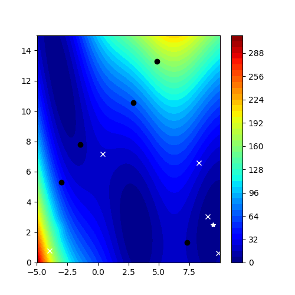

# Bayesian Optimization

Bayesian Optimization is among a class of sample efficient global optimization approach where a probabilistic model is built to approximate an unknown objective function and optimised using an acquisition function which evaluates future candidate samples. These acquisition functions focus only on the immediate function evaluation that approximates the unknown objective function better. Non myopic acquisition function evaluates multiple steps to get an observation that results in much better convergence in finding the global optimum. This project focuses on implementing Rollout using one of the existing acquisition functions in the literature "Expected Improvement" as a base policy and approximate the unknown function using a Gaussian Process surrogate model.

## Results
Results of rolling out for 8 horizons against one step EI




## Installation

We use the Poetry tool which is a dependency management and packaging tool in Python. It allows you to declare the libraries your project depends on and it will manage (install/update) them for you. Please follow the installation of poetry at https://python-poetry.org/docs/#installation

After you've installed poetry, you can install all the dependencies by running the following command in the root of the project:

```
poetry install
```

## Running Demos

```
poetry run python demos/test_1d.py
```

Look at the tests for more details.

### FYI

Output receives a dictionary containing ```history``` and ```optimization_time```.